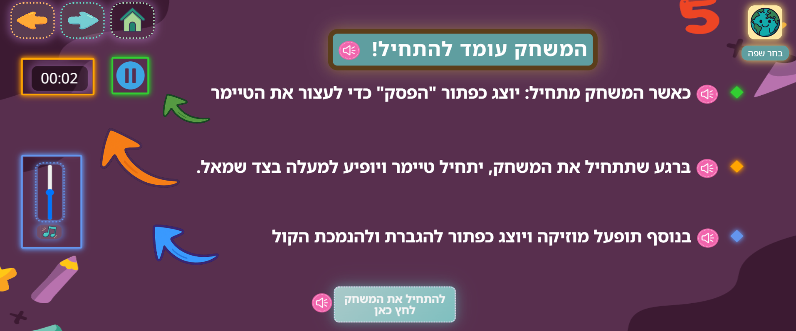
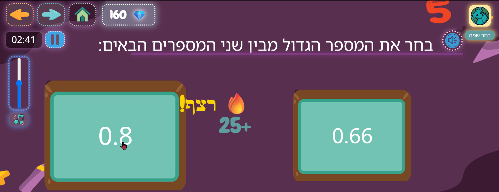

# 📘 Math Tutor in Decimal Numbers
An interactive educational game built with HTML, CSS, and JavaScript (Reveal.js), designed to help students understand and compare decimal numbers through guided tutorials, audio-visual feedback, and quiz-based practice.

---

## 🔍 Overview
This interactive math game is built using Reveal.js and custom JavaScript/CSS. It is designed to teach decimal structure and place values through engaging tutorials and gamified multiple-choice questions.  
It is based on research highlighting the cognitive difficulties students face when comparing decimals. The design integrates gradual explanation, visual scaffolding, and auditory support to improve understanding for all learners—especially those with learning disabilities.

---

## 🌍 Language Support
- **Hebrew**
- **Arabic**

Both languages include full audio instructions, ensuring accessibility for students with reading difficulties.

---

## 📚 Research Background
This project is based on two articles:
1. *Why is learning fraction and decimal arithmetic so difficult?*
2. *Inhibitory control and decimal number comparison in school-aged children*

These studies emphasize how students often misinterpret decimals due to visual bias and lack of conceptual understanding (e.g., thinking 0.14 is greater than 0.4). The game directly addresses this by:
- Using a “House of Numbers” to break down decimal structure
- Forcing side-by-side alignment on a number line
- Giving detailed feedback regardless of whether the answer was right or wrong

The game supports self-paced learning and encourages meaningful interaction—two principles known to increase engagement and retention for students with learning difficulties.

---

## 🚀 Features

### 🧠 Educational Content
- Covers decimal number structure.
- Gradual explanation of whole vs. fractional parts.
- Visual model: “House of Numbers” and number line.
- Repetition and reinforcement regardless of correctness.

### 🕹️ Game Mechanics
- Interactive quiz with audio-visual feedback.
- Supports Hebrew & Arabic (written + audio).
- Includes:
  - “Correct/Wrong” sounds.
  - Streak bonus effects.
  - Live point tracking.
  - End-of-game summary: points + time.

### 🎨 Design & User Interface
- Dark-themed, kid-friendly, and responsive.
- Hover effects, glowing buttons, floating animations.
- Glassmorphism interface for clarity and aesthetics

### 🔊 Audio Integration
- Instructional voiceovers per language
- Feedback effects (peek, pop, streak)
- Background music with mute toggle + volume slider

### 🧪 Technical Highlights
- Built with Reveal.js + custom logic
- Skips feedback-only slides when navigating
- Randomized question order on each play (Shuffle)
- Timer pauses and resumes
- “Continue” buttons are generated only after feedback

---

## 🎮 Game Summary
- Step-by-step tutorial with audio/visual guides
- Adaptive feedback to user performance
- Encourages conceptual understanding, not just memorization
- Designed for students with and without learning disabilities

---

## 🖼️ Screenshots

### 📌 Intro Slide  
  
*The introduction screen where the student chooses which topic to learn.*

### 📌 Decimal System Topic  
  
*The first slide of the topic chosen in the intro screen.*

### 📌 Instruction Slide  
  
*An explanation of what the student needs to do in the tutorial and game.*

### 📌 Language Toggle  
  
*Shows that the user can switch between two languages. Audio is fully supported in both.*

### 📌 Example Slide  
  
*A sample question used as a warm-up before the game section.*

### 📌 Main Explanation  
  
*An explanation of the decimal structure, supported by visual elements.*

### 📌 Numbers Axis Explanation  
  
*A visual comparison of decimal numbers placed on a number axis.*

### 📌 Example Implementation  
  
*A follow-up slide that applies the example using abstract and structured visual explanations.*

### 📌 Game Elements Explained  
  
*A breakdown of game elements like the timer, pause button, background music, and volume slider.*

### 📌 Streak Points System  
  
*In the game section, if the player gets 3 or more answers correct in a row, they receive a +25 points streak bonus.*

### 📌 Final Results  
  
*The final screen showing the student’s results: time taken, total score, and number of correct answers.*

---

## 📁 Project Structure
```
/Math-tutor.html           → Main HTML presentation  
/Math-tutor.js             → JavaScript logic for game behavior  
/custom.css                → Styling for layout and animations  
/images/                   → Folder for screenshots and assets  
/README.md                 → This file  
```

---

## 👩‍🏫 Author
Created by **Hazar Zoabi**  
M.A. in Learning Disabilities – Faculty of Education  
Current student in Computer Science – University of Haifa  
CS Project Course

---

## 📌 License
© 2025 Hazar Zoabi. All rights reserved.  
This project is protected under copyright law.  
No part of this project may be reproduced, distributed, or used commercially without explicit written permission from the author.
